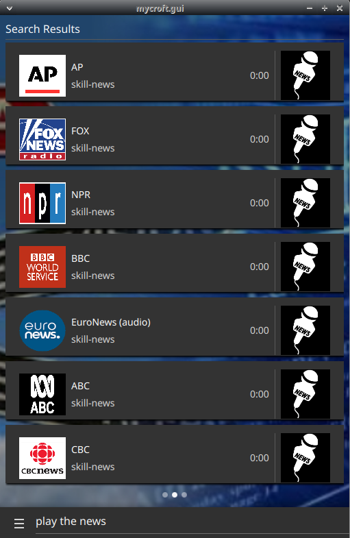
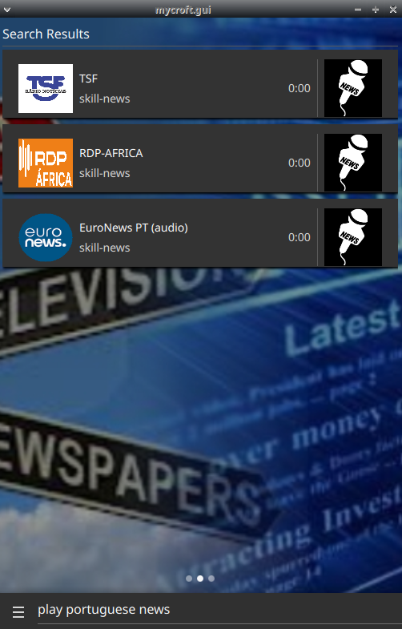

#  News Streams

News Streams catalog

## About 

News streams from around the globe





PRs adding new feeds welcome, especially for unsupported languages

Supported stations include:

- [EN-CA] CBC News
- [EN-AU] ABC News Australia
- [EN-GB] BBC News
- [EN-GB] EuroNews (video + audio)
- [EN-US] Associated Press (AP) Hourly Radio News
- [EN-US] Fox News
- [EN-US] NPR News Now
- [EN-US] PBS NewsHour
- [EN-US] GPB - Georgia Public Broadcasting
- [EN-US] SkyStream (video + audio)
- [EN-US] TWC - The Wheater Channel (video + audio)
- [RU] EuroNews (video + audio)
- [IT] EuroNews (video + audio)
- [FR] EuroNews (video + audio)
- [ES-ES] RNE Radio Nacional de España
- [ES-ES] EuroNews (video + audio)
- [CA-ES] CCMA Catalunya Informació
- [PT-PT] TSF Rádio Notícias
- [PT-PT] Noticiários RDP África
- [PT-PT] EuroNews (video + audio)
- [NL] VRT Nieuws
- [DE] Ö3 Nachrichten
- [DE] DLF
- [DE] WDR
- [DE] EuroNews (video + audio)
- [FI] YLE
- [SV] Ekot

### Installation

If you are using this skill, you have to [disable the official skill](https://mycroft-ai.gitbook.io/docs/skill-development/faq#how-do-i-disable-a-skill) because they are incompatible

To play https streams properly you also need to install vlc

```bash
sudo apt-get install vlc
```

and make it the default it in your .conf

```json
  "Audio": {
    "backends": {
      "local": {
        "active": false
      },
      "vlc": {
        "active": true
      }
    },
    "default-backend": "vlc"
  },
```

## Examples 

* "play the news"
* "play npr news"
* "play euronews"
* "play catalan news"
* "play portuguese news"
* "play news in spanish"

## Credits 
- JarbasAl

## Category
**Information**

## Tags
#news